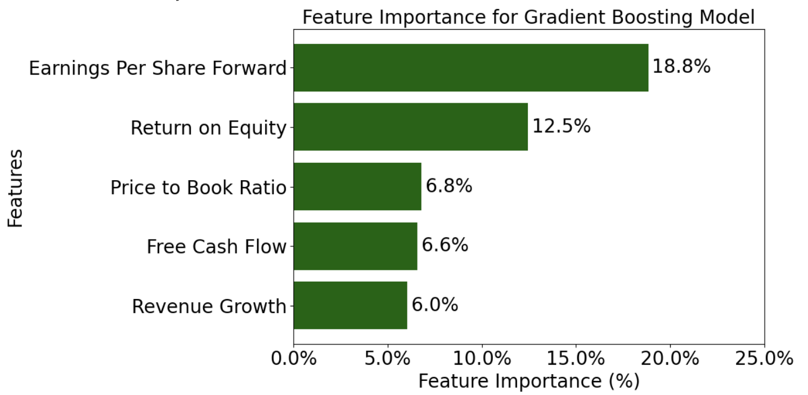
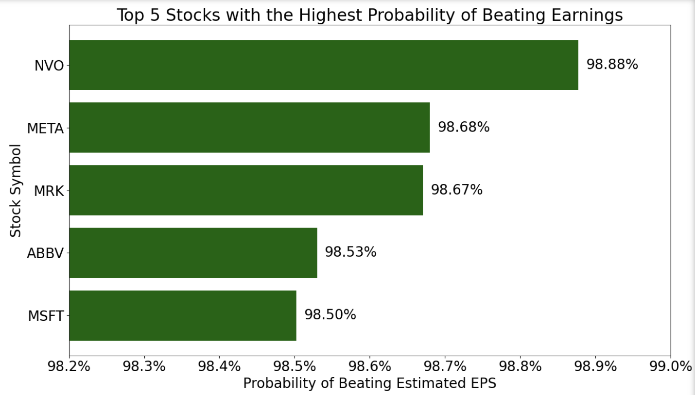

# project_phase3

## Overview
This project uses predictive machine learning in order to predict whether a stock will beat its' next quarterly estimated earnings per share (EPS) or not. The idea is that beating estimated EPS is a sign of strong financials, increasing profitability, and future growth potential. Using financial metrics, like P/E and Free Cash Flow, as well as historical earnings data, we created and enhanced a model to predict EPS result using a Decision Tree with added preprocessing and hyperparameters. The result is promising and provides solid framework for additional parameters to be added in order to enhance model performance and presents helpful information on which financial metrics are most important in deciding future stock price growth. 

## Business Understanding
- **Key Business Questions:**
    - What is a good indicator that a stock will perform well in the future?
    - Which parameters should be used to create a model to predict if a stock will beat its' next estimated EPS?
    - What type of machine learning model should be used to predict this outcome?
    - What is more detrimental in our specific use-case, missing out on a stock predicted to not beat their estimated EPS and it did, or predicting a stock would beat its' estimated EPS and it did not?
    - Which classificication metric is most important to maximize?

## Data Understanding and Analysis
- **Source of Data:** Yahoo Finance and NASDAQ.com
- **Description of Data:** Stock tickers and names, market caps, financial metrics, and EPS history

- **Visualizations:**
    1. 
    2. 
 

## Conclusion
- **Summary of Conclusions:**
    1. Upon running both a logistic regressioin model and a decision tree model, the decision tree had better metrics. The metric we wanted to maximize was Precision. Since we are recommending stocks for our investors to purchase, with the assumption that these stocks will increase in price, we only want to recommend stocks which have a very high probability of beating their next estimated EPS. Recommending a stock that does not beat its' estimated EPS is the worst case scenario, as the investor has a high probability of losing money, whereas incorrectly predicitng a stock will not beat its' estimated EPS, and it does, is not as bad because the investor is not losing money. Missing out on a potentially profitable stock is better than incorrectly predicting and recommending an unprofitable stock. 

    2. Final model Precision Value: 88%. 
    * This means that of all the stocks the model predicted to beat their estimated EPS, 88% were correctly predicted. 

    3. Top 5 Features with Highest Contribution to EPS result
    * 1. Earnings Per Share Forward: 18.8%
    * 2. Return on Equity: 12.5%
    * 3. Price to Book Ratio: 6.8%
    * 4. Free Cash Flow: 6.6%
    * 5. Revenue Growth: 6.0%

    4. Top 5 Stocks with Highest Probability of Beating Next Estimated EPS
    * 1. NVO: 98.88%
    * 2. META: 98.68%
    * 3. MRK: 98.67%
    * 4. ABBV: 98.53%
    * 5. MSFT: 98.50%

    As financial metrics and historical data is updated, these results will change. These are the results as of December 9 2024. 
 
 ## Limitations, Solutions, and Future Actions
- **Limitations**
    * Yahoo Finance and NASDAQ are not real-time data. The data is updated in an unknown periodic timeframe, like daily or weekly. 
    * Pulling large amounts of data and manipulating it is computationally intensive. 
    * A stock beating its' estimated EPS is not a guarantee that the price will increase. 

- **Solutions**
    * Financial Data Prividers, like Alpha Vantage and Bloomberg Terminal, are paid services which provide real-time price and metric data, as well as more extensive historical data. 
    * Graphics Processing Units (GPUs) can be purchased or rented in order to increase the computational power of our machine in order to process and model data much faster. Data centers also provide servers and GPUs which you can physically rent in order to run models or virtually rent through the cloud. 
    * With the induction of greater computational power and up to date financial metrics, further parameters and more historical data can be input into our model in order to enhance model robustness and find which parameters are most useful in predicting future stock growth. On top of this, other metrics besides a stock beating its' estimated EPS may be more useful in predicting future stock price performance. 

- **Future Actions**
    * Research more financial metrics to try modeling in order to predict future stock price growth
    * Technical Analysis indicators may be very useful in future price predictions
    * Other ML algorithms like Neural Networks and Support Vector Machnines may lead to greater performance outcomes

  ## Links

  -  [Google Slides Presentation]()